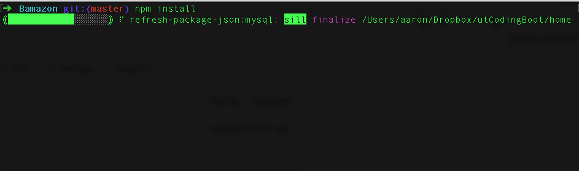
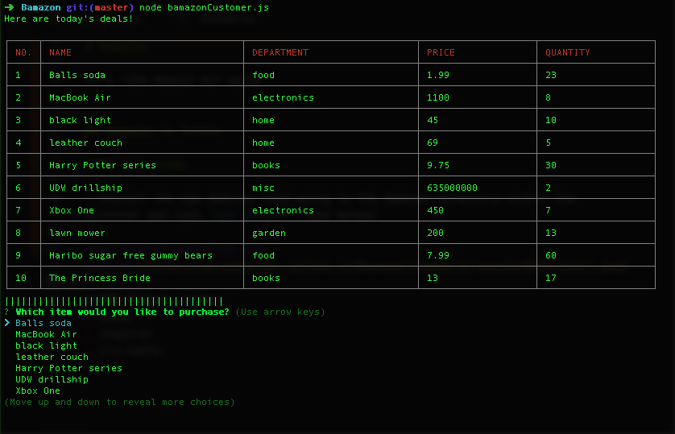
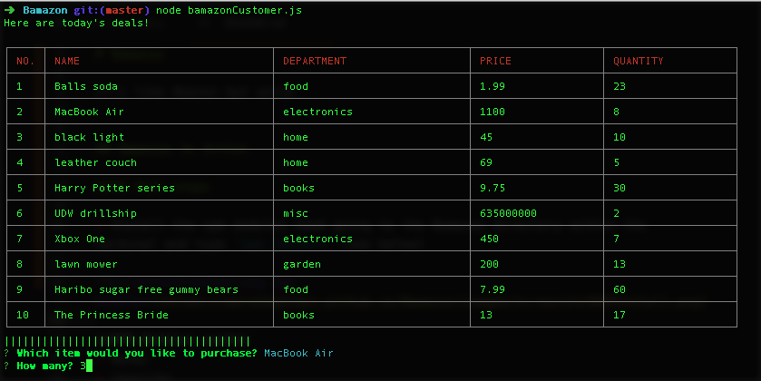
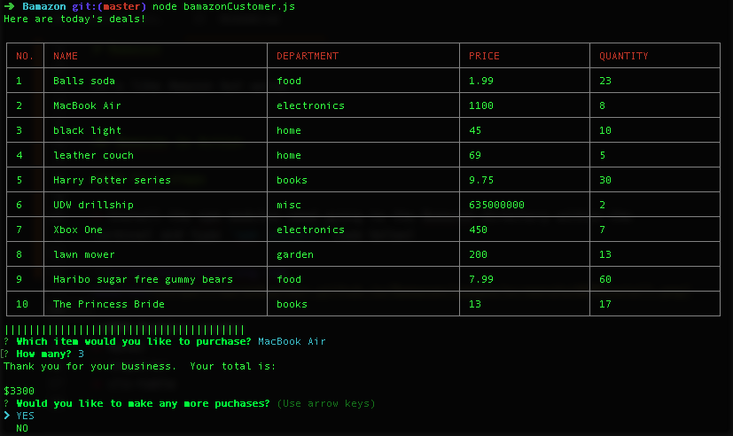
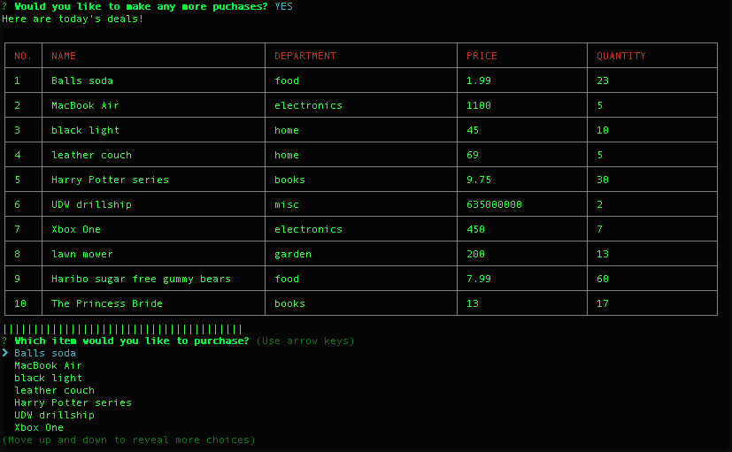
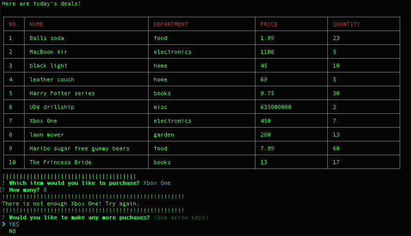

# Bamazon

It's like Amazon but worse

---
## Bamazon in Action

#### First Steps

* Install the npm modules need going to the Bamazon directory within the terminal and type `npm install` (see below)

**NPM Modules used**
* mysql
* inquirer
* cli-table

#### Second Steps

* Run the BamazonCustomer.js file using `node BamazonCustomer.js`

* Pick an item you'd like to purchase and an amount

* Bamazon will let you know the total amount due for the items

* You then have the option of make more purchases or quitting

* If there is not enough of the item you want, Bamazon will let you know

*Aaron Walker 2017*
